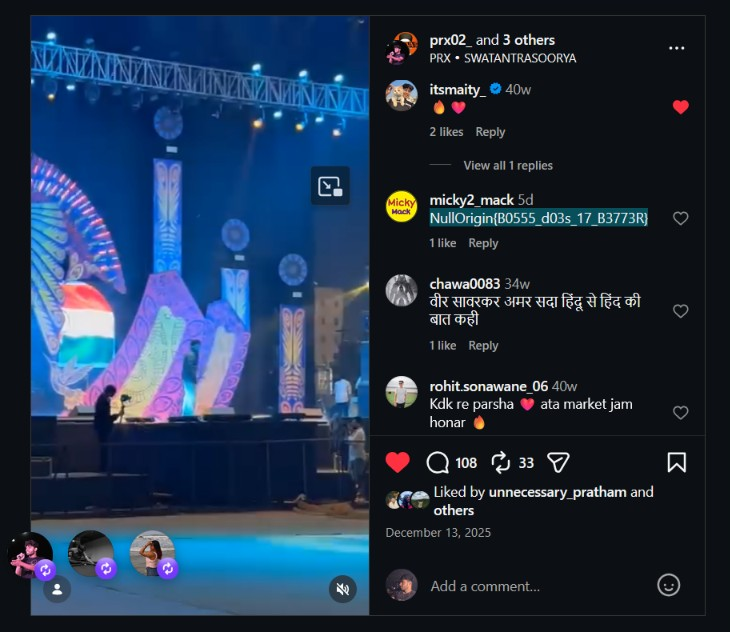
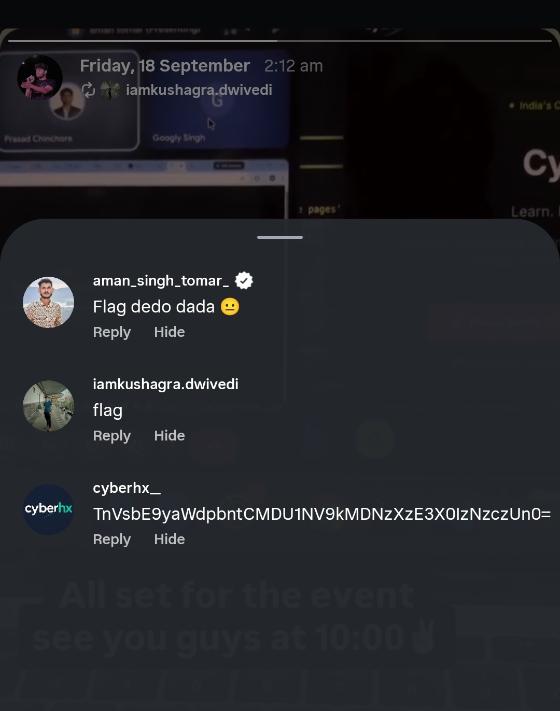

# Sanity 3

## Challenge Description

**Description:**  
> *"Rapper know Everything, the admin joins the party"*

This challenge is a sanity-check challenge centered around Open Source Intelligence (OSINT) and social-media investigation. Players are expected to take the clue discovered in the previous "CTFCeption" challenge and investigate the public Instagram profile of the rapper **PRX02** to locate the hidden flag.

## Intended Approach

The intended solution involves chaining clues across the CTF series. In the earlier "CTFCeption" challenge, players uncovered a hint referencing the artist **PRX02** and an upcoming song titled *"Lokmanya Gatha"*, scheduled for release on 25th September. Using this information, the player conducts OSINT by searching for PRX02's official Instagram profile (`prx02_`) and inspecting its posts, stories, broadcast channels, and comments.

---

## Step-by-Step Solution

### Step 1 — Follow the Previous Challenge's Clue

From the previous CTFCeption challenge, we received a clear hint referencing the rapper **PRX02** and his upcoming track *"Lokmanya Gatha"*. 

Searching for PRX02 on Instagram leads directly to the official profile:
- **Instagram Handle:** `@prx02_`

### Step 2 — Investigate the Instagram Account

Once on the profile, we inspect recent posts, pinned content, highlights, stories, and the comment sections. No web exploitation or technical vulnerability exploitation is required here—the focus is purely on OSINT and thorough inspection of public social media activity.

### Step 3 — Find the Flag in the Comments

Looking through the posts and reels on the profile (such as the performance clip with Swatantrasoorya), we examine the comments section. 

In the comments of the post, a user named `micky2_mack` has posted the plaintext flag directly:

```text
NullOrigin{B0555_d03s_17_B3773R}
```


*Figure 1 — The flag is directly visible in the pinned post's comments.*

### Step 4 — Identify the Base64-Encoded Flag

Alternatively, exploring the account's story interactions and broadcast channel replies reveals another instance of the flag.

In a story/broadcast interaction where users were asking for the flag (`"flag"`, `"Flag dedo dada 😐"`), user `cyberhx_` replied with a Base64-encoded string:

```text
TnVsbE9yaWdpbntCMDU1NV9kMDNzXzE3X0IzNzczUn0=
```


*Figure 2 — Base64-encoded flag found in the Instagram story/comments.*

### Step 5 — Decode the Base64

We can decode the Base64 string using any standard Base64 decoder or via the command line:

```bash
echo 'TnVsbE9yaWdpbntCMDU1NV9kMDNzXzE3X0IzNzczUn0=' | base64 -d
```

**Decoded Output:**
```text
NullOrigin{B0555_d03s_17_B3773R}
```

Both methods yield the exact same flag.

---

## Final Answer

**Flag:**
```text
NullOrigin{B0555_d03s_17_B3773R}
```

---

## Methodology

- **OSINT** (Open Source Intelligence)
- **Social-Media Investigation**
- **Instagram Post/Comment Analysis**
- **Base64 Decoding**

---

## Key Takeaway

Sanity and OSINT challenges reward attention to detail and thorough recon. By systematically following clues from prior stages and inspecting all user-facing content (posts, stories, broadcast channels, and comments), flags can often be retrieved quickly without complex exploitation.

